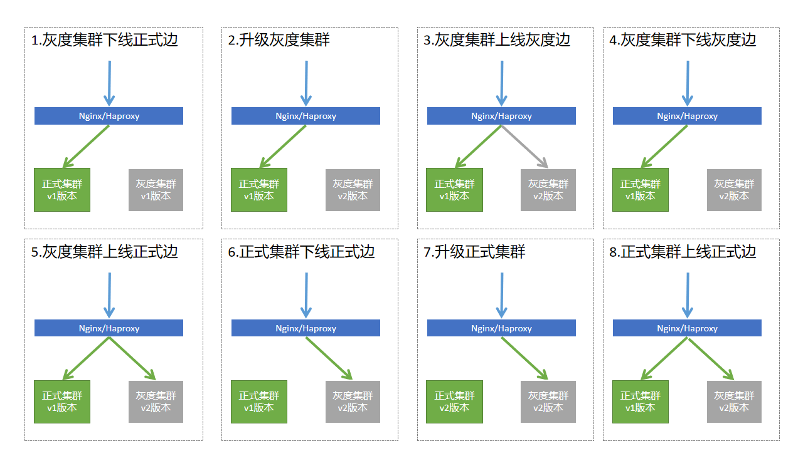

# canary-deploy

## 场景
有两个集群：正式集群和灰度集群，集群内部为滚动分批次部署，集群间为金丝雀部署

金丝雀部署步骤
0.初始状态（所有流量访问正式和灰度集群）   
1.灰度集群下线（所有流量访问正式集群）    
2.升级灰度集群    
3.灰度集群上线灰度边（正式流量访问正式集群，灰度流量访问灰度集群）  
4.灰度验证  
5.灰度集群从灰度边下线（所有流量访问正式集群）    
6.灰度集群上线正式边（所有流量访问正式和灰度集群）  
7.正式集群下线（所有流量访问灰度集群）    
8.正式集群上线（所有流量访问正式和灰度集群）

## docker-nginx
使用nginx的负载均衡实现灰度发布

## docker-haproxy
使用haproxy的负载均衡实现灰度发布